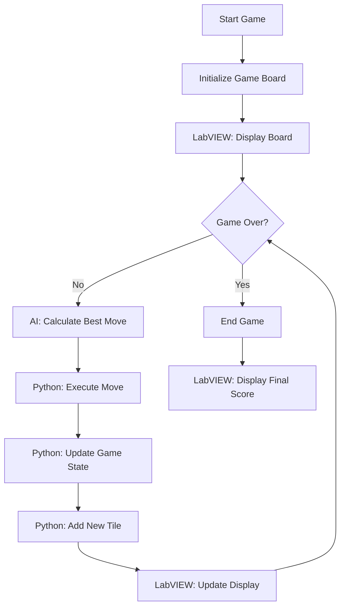

# 2048 Game AI Project

## Table of Contents
1. [Introduction](#introduction)
2. [Project Overview](#project-overview)
3. [Components](#components)
4. [Game Logic](#game-logic)
5. [AI Algorithm: Expectiminimax](#ai-algorithm-expectiminimax)
6. [LabVIEW Interface](#labview-interface)
7. [Process Flow](#process-flow)
8. [Key Features](#key-features)
9. [Setup and Installation](#setup-and-installation)
10. [Usage](#usage)
11. [Future Improvements](#future-improvements)

## Introduction
This project implements an AI agent to play the popular 2048 game. It combines a Python backend for game logic and AI decision-making with a LabVIEW frontend for visualization and user interaction.

## Project Overview
The 2048 game is played on a 4x4 grid where the player combines tiles with the same number to create a tile with the sum of their values. The goal is to create a tile with the value 2048. This program features a dual-gameboard setup, allowing interactive gameplay between two players: Player 1 (human-controlled), and Player 2 (togglable between human and AI control). Users can compete with the AI or another person to reach the highest score.

## Components
1. **Python Backend:**
   - Implements the game logic
   - Contains the AI algorithm (Expectiminimax)
   - Manages the game state and score

2. **LabVIEW Frontend:**
   - Provides a graphical user interface for the game
   - Visualizes the game board and score
   - Interfaces with the Python backend

## Game Logic
- The game is represented by a 4x4 grid (`gridCell`)
- Valid moves: Up, Down, Left, Right
- After each move, a new tile (2 or 4) is randomly added to an empty cell
- The game ends when no valid moves are possible

## AI Algorithm: Expectiminimax

The AI in this project uses the Expectiminimax algorithm, a variation of the Minimax algorithm used in two-player games. Expectiminimax is particularly suited for games with elements of chance, like the random tile spawns in 2048.

### Algorithm Overview

1. **Max Nodes (AI's Turn):** Choose the move that maximizes the expected score.
2. **Expectation Nodes (Random Tile Spawn):** Calculate the weighted average of all possible outcomes.
3. **Min Nodes (Opponent's Turn):** In 2048, these represent the worst-case scenarios for tile placements.

### Visual Representation

Here's a simplified tree diagram of the Expectiminimax algorithm:

[Expectiminimax Tree Diagram Will Be Displayed Here]
[Previous sections remain unchanged until AI Algorithm section]

## AI Algorithm: Expectiminimax

The AI in this project uses the Expectiminimax algorithm, a variation of the Minimax algorithm used in two-player games. Expectiminimax is particularly suited for games with elements of chance, like the random tile spawns in 2048.

### Algorithm Overview and Tree Structure
```
                    Current Board State (MAX)
                    /     |      |      \
                   /      |      |       \
                  UP    DOWN   LEFT    RIGHT
                 /|\     /|\    /|\     /|\
                / | \   / | \  / | \   / | \
     (EXP)    2  2  4  2  2  4 2  2  4 2  2  4
              /|\           (Possible new tiles)
             / | \
   (MIN)    P1 P2 P3    (Possible positions)
```

1. **Level 1: MAX Node (AI's Turn)**
   - Purpose: Choose the best possible move
   - Options: UP, DOWN, LEFT, RIGHT
   - Example evaluation:
     ```
     Initial Board:
     2  4  2  4
     4  2  4  2
     2  4  2  4
     4  2  4  2
     ```

2. **Level 2: EXP Nodes (Random Tile)**
   - Purpose: Calculate expected value considering random tile spawns
   - Probabilities:
     * 2 tile: 90% probability
     * 4 tile: 10% probability
   - Example for UP move:
     ```
     After UP move:
     8  8  8  8
     4  4  4  4
     0  0  0  0
     0  0  0  0
     ```

3. **Level 3: MIN Nodes (Tile Position)**
   - Purpose: Consider worst possible positions for new tile
   - Example:
     ```
     After 2 spawns in different positions:
     8  8  8  8          8  8  8  8
     4  4  4  4    vs    4  4  4  4
     2  0  0  0          0  0  0  2
     0  0  0  0          0  0  0  0
     ```

### Scoring System

1. **Monotonicity Weight: 1.0**
   ```
   Good monotonicity:     Poor monotonicity:
   16  8   4   2         2   16  4   8
   8   4   2   0         4   2   8   2
   4   2   0   0         16  4   2   4
   2   0   0   0         2   8   4   2
   ```

2. **Empty Tiles Weight: 2.7**
   ```
   More empty (better):   Less empty (worse):
   4   4   2   2         4   2   4   2
   0   0   2   0         2   4   2   4
   0   0   0   0         4   2   4   2
   0   0   0   0         2   4   2   4
   ```

3. **Merge Potential Weight: 1.0**
   ```
   Good merge potential:  Poor merge potential:
   2   2   4   4         2   4   2   4
   2   2   4   4         4   2   4   2
   8   8   2   2         2   4   2   4
   8   8   2   2         4   2   4   2
   ```

### Implementation Details

1. **Depth-Limited Search (`DEPTH_LIMIT = 1`):** 
   - The algorithm looks ahead a specified number of moves to balance between decision quality and computational efficiency.
   - A deeper search (higher `DEPTH_LIMIT`) can lead to better decisions but requires more processing time.

2. **Score Calculation**
   ```
   Score = w1 * Monotonicity + w2 * EmptyTiles + w3 * MergePotential

   Example:
   - Monotonicity: 0.8 * 1.0 = 0.8
   - Empty Tiles: 6 * 2.7 = 16.2
   - Merge Potential: 0.6 * 1.0 = 0.6
   Total Score = 17.6
   ```

3. **Probability Weighting:**
   - Implemented in the `score_tile_choose_node()` function
   - Considers the probability of spawning a 2 (90%) vs a 4 (10%) when calculating expected outcomes.
   - Low Probability Cutoff (`LOW_PROBABILITY = 0.000001`)

4. **Decision Process**
   ```
   Current Board → UP Move → 90% chance of 2 → Consider Position 1
                                → Consider Position 2
                                → Consider Position 3
                         → 10% chance of 4 → Consider Position 1
                                → Consider Position 2
                                → Consider Position 3
   ```

### Optimization Techniques

1. **Alpha-Beta Pruning:** Could improve performance by eliminating unnecessary branches
2. **Move Ordering:** Evaluates promising moves first
3. **Transposition Table:** Reduces redundant calculations

### Revive Function
The `revive()` function is a unique feature that attempts to recover from challenging board states:
- Identifies the highest-value tile and clears an adjacent tile if possible
- Creates new merging opportunities when the board is nearly full

[Remaining sections continue unchanged]


### Algorithm Flow

1. Start at the max node (AI's turn).
2. For each possible move:
   - Apply the move to create a new game state.
   - Create expectation nodes for all possible tile spawns (2 or 4 in empty cells).
   - For each expectation node, create min nodes representing worst-case scenarios.
   - Recursively evaluate the tree up to the specified depth.
3. Calculate the expected value of each move, considering the probabilities of random tile spawns.
4. Choose the move with the highest expected value.

### Optimization Techniques

1. **Alpha-Beta Pruning:** Although not explicitly implemented in the provided code, this technique could significantly improve performance by eliminating branches that don't need to be explored.
2. **Move Ordering:** Evaluating more promising moves first can enhance the effectiveness of pruning techniques.
3. **Transposition Table:** Storing and reusing evaluations of previously seen board states can reduce redundant calculations.

### Revive Function

The `revive()` function is a unique feature that attempts to recover from challenging board states:
- It identifies the highest-value tile and clears an adjacent tile if possible.
- This can potentially create new merging opportunities when the board is nearly full.

## LabVIEW Interface
The LabVIEW component of this project serves as the front-end interface, providing the following functionalities:

1. **Game Board Visualization:** Displays the current state of the 4x4 grid, updating after each move.
2. **Score Display:** Shows the current score and possibly the highest tile achieved.
3. **Game Control:** Provides buttons or controls to start a new game, pause, or exit.
4. **Move Indication:** Visually indicates the moves made by the AI.
5. **Python Integration:** Uses LabVIEW's Python Node to communicate with the Python backend.
6. **Performance Metrics:** Possibly displays metrics like moves per second or decision time.

The LabVIEW VI (Virtual Instrument) acts as the main entry point for the application, initializing the Python environment and managing the game loop.

## Process Flow
Here's a high-level flow chart of the game process:
## Process Flow


This flow chart illustrates the interaction between the LabVIEW frontend and the Python backend, showing how the game state is managed and updated throughout the gameplay.

## Key Features
1. **Automated Gameplay:** The AI can play the game without human intervention
2. **Move Prediction:** Calculates the best move based on the current board state
3. **Score Tracking:** Keeps track of the game score as tiles are merged
4. **Game Over Detection:** Identifies when no more moves are possible
5. **Revival Mechanism:** Implements a "revive" function to potentially continue gameplay in difficult situations

## Setup and Installation
1. Ensure you have Python installed (version 3.6 or higher recommended)
2. Install LabVIEW (version 22.5 or higher)
3. Install required Python libraries:
   ```
   pip install tkinter
   ```
4. Clone the repository or download the source files
5. Open the main LabVIEW VI (2048_Game_AI.vi)

## Usage
1. Launch the LabVIEW VI (2048_Game_AI.vi)
2. Click the "Start Game" button on the LabVIEW front panel
3. Two game boards will appear for Player 1 (human-controlled) and Player 2 (toggleable between human and AI control)
4. Make moves for Player 1 manually, while Player 2 follows the selected control mode
5. Observe each player's score and progress on the LabVIEW interface
6. The game ends when 2048 is reached or no more moves are possible
7. Use the "New Game" button to start a fresh game, or "Exit" to close the application

## Future Improvements
1. Implement a user-playable mode alongside the AI
2. Optimize the AI algorithm for better performance
3. Add difficulty levels by adjusting the search depth
4. Implement a leaderboard system
5. Extend the game beyond the 2048 tile
6. Add real-time visualization of the AI's decision-making process

---

Note: Ensure that the Python environment is properly configured in LabVIEW to allow seamless communication between the LabVIEW frontend and Python backend.
